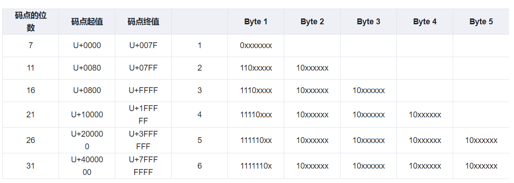

# 知识巩固

## 饱和加法

* 产生指定位宽的有符号数最大值和最小值

```C
// 0000 0001
// 1000 0000 
// 0111 1111 ==> 2^7 - 1 = 127
long signed_max(int bitwidth){
    return (1L << (bitwidth - 1)) - 1;
}

// 1111 ... 1111 1111 1111
// 1111 ... 1111 1000 0000 ==> -2^7 = -128
long signed_min(int bitwidth){
    return ~0L << (bitwidth - 1);
}
```


## UTF-8编码

UTF-8是对Unicode字符集的一种编码形式，Unicode字符集由一种称为码点(code point)的形式进行标识。UTF-8编码中标识码点为一系列字节。第一个字节标识前导字节，标识了有几个字节标识该字符，后续字节称为连续字节，连续字节的前两位总是为 `10`。前导字节中位为1的数量表示总共有几个字节。



example:

```
The Unicode code point for € is U+20AC

U+20AC 处于码点范围是 U+0800 到 U+FFFF之间，因此该编码需要三个字节进行编码

十六进制的 0x20AC 的二进制表示为 0010 0000 1010 1100

前导字节的高位是固定的，三个1（表示三个字节序列）加上一个0，即1110，低位则是码点表示的前四位，即0010。组合起来就是 1110 0010

连续字节，高位是固定的10， 后面6位则是码点的表示，即0000 10，组合起来就是1000 0010

因此，总的编码表示为

1110 0010 1000 0010 1010 1100
```

